<!--
theme: gaia
paginate: true
header: '--DevSecOps and Cloud security automation--'

-->


<!-- _class: lead -->
# DevSecOps and Cloud Security

### "Deliver resilient software capability at the speed of relevance"
---

### Application Security Analyst and DevSecOps expert
- Web and mobile Developer
- +20 Application Security Evaluation
- SANS 540 DevSecOps and Cloud Security automation
- CTF Player/ Organizer
- I love microservices 
- Cloud Native Application security advocate
---

## What you will learn
All what you need to secure your CI/CD pipeline !

---
## Agenda
# Day 1 : 
## Attacking and Hardening the DevOps Toolchain
---
<!-- _class: lead -->
# Day 1 : 
## Attacking and Hardening the DevOps Toolchain

---
## Lab environment overview
| Role                      | Systems(s)                             |
|:--------------------------|:---------------------------------------|
| Version Control           | GitLab, CodeCommit                     |
| CI/CD                     | Jenkins, CodePipeline                  |
| Configuration manager     | Ansible, CloudFormation                |
| Container Execution       | Docker, K8s                            |
| Secret Storage            | Vault                                  |
| Cloud Infrastructure      | AWS                                    |

---

## Lab setup summary
- Port conflict (GITLAB/JENKINS)
- HTTPS issue in GITLAB/JENKINS integration
- Authorizing local IP addresses in GitLab for WebHooks

----

## Day 1 :Attacking and Hardening the DevOps Toolchain

- DevOps security challenges
- DevOps toolchain

----

## DevOps success factors
CAMS (or CALMS) is a common lens for understanding DevOps and for driving DevOps change. Your organization succeeds when it reaches "CALMS":
- Culture: people come first
- Automation: rely on tools for efficiency and repeatability
- Lean: apply Lean engineering practices to continuously learn and improve
- Measurement: use data to drive decisions and improvements
- Sharing: share ideas, information, and goals across silos

----
<style scoped>
{
  font-size: 35px
}
</style>
### DevOps Unicorns
The DNA of DevOps and DevSecOps comes from a few early leaders or"unicorns":
- Netflix: Undifferentiated heavy lifting in the cloud, Chaos Engineering
- Amazon: You Build It... You Run It, two-pizza teams dogfooding AWS
- Google: Site Reliability Engineering, fearless shared postmortems
- Twitter: Self-service security for developers, immediate feedback
- Etsy: Security in Continuous Deployment, "a Just Culture"
----
<style scoped>
{
  font-size: 30px
}
</style>
### CALMS: Culture

Signs of a culture that supports DevOps:
- Failures are accepted and used as learning opportunities.
    - Accept that failures can and will happen.
    - Utilize blameless postmortems to learn and improve from failures.
- Find ways to minimize impact or "blast radius."
- --Collaboration-- occurs widely across functional lines.
- Problem-solving: the problem is the enemy.
- Empower teams to take action on their own.
- Staff have a shared sense of ownership and accountability.
- --High levels of trust-- allow people to feel safe with each other.
---
<style scoped>
{
  font-size: 29px
}
</style>
### CALMS: Automation
DevOps teams use programmable tools and cloud service APIs to:
- Take care of "undifferentiated heavy lifting" and repetitive work
- Continuously iterate and experiment in production
- Increase transparency
- Ensure consistency
- Prevent common mistakes
- Enable measurement and sharing
- Control operations at scale


---
<style scoped>
{
  font-size: 29px
}
</style>
### CALMS: Automation "Everything as Code"
Get everything into code and check it into version control:
- Application source code/package dependencies
- Operations scripts
- Application configuration
- Tests and test scripts
- Build, deployment scripts, and runbooks
- Infrastructure provisioning and configuration
- Documentation
- Database definitions and change scripts
- Security/compliance policies
- Security tool configuration

---
<style scoped>
{
  font-size: 29px
}
</style>
### CALMS: Lean engineering

Lean engineering improves efficiency, reduces friction, eliminates hand-offs and delays:
- Confront bureaucracy.
- Use Value Stream Mapping to identify waste, bottlenecks, and delays.
- Leverage Automation for routine work.
- Measurement: Use data to drive continuous improvements.
- Prioritize just in time-always work on what's important.
---
<style scoped>
{
  font-size: 29px
}
</style>
### CALMS: Measurements

Measurements can help you to understand-and improve-how your teams work and where to automate:
1. Change frequency
2. Change failure/success rate
3. Correlation between change frequency and failure rate
4. MTTR recovery window instead of MTTF (time to failure)
5. Change lead time to deliver a change or fix, from check-in to deployment

---
<style scoped>
{
  font-size: 29px
}
</style>
### CALMS: Measurements for DevSecOps
Collect security metrics along your delivery pipelines to assess how healthy your code is and how healthy your security program is.
- Measure automated test coverage for high-risk code
- Track # of vulnerabilities found... and where they were found in the pipeline
- Track # of vulnerabilities fixed
- How long vulnerabilities remain open (window of exposure)
- Type of vulnerability (OWASP Top 10) for Root Cause Analysis
- Elapsed time for security testing-make feedback loops as short as possible
- False positives versus true positives-improve quality of feedback
- Vulnerability escape rate to production
---
<style scoped>
{
  font-size: 29px
}
</style>
### CALMS: Sharing
Information should be shared freely across the organization.
- Everyone has access to all information that they need to do their job.
- Eliminate hand-offs where information/knowledge is often lost.
_Open up communications channels across teams/functional lines._
- Chat and ChatOps, shared code repos, backlog tools, dashboards, etc.
_Share goals and accountability across Dev, Ops, and Security._
- Everyone has a stake in success and preventing failures.
_Evangelism through conferences, blogs, articles, podcasts, etc._
- DevOps has an active, open community (DevOpsDays, open-source tools...).
- Vendors have latched on to this hyperactivity.

---
<style scoped>
{
  font-size: 29px
}
</style>
### CALMS: US DOD case study
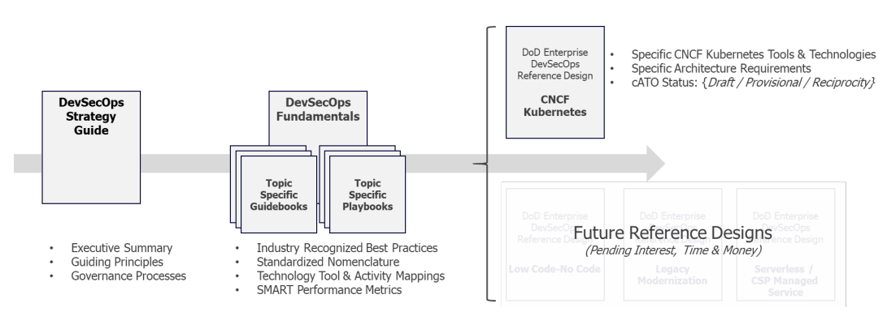


---
## Security culture vs DevOps
DevOps culture conflicts with traditional security culture:
- Top-down risk management instead of team-based decision-making
- Need to know restrictions versus extended information sharing
- Zero failure versus fail fast and fail forward
- Limiting change: Security is always ready to say "No!"
---
<style scoped>
{
  font-size: 29px
}
</style>
### Security Challenges in DevOps

Powerful new technologies create opportunities for attackers-and new risks for organizations:
- Weaknesses in the DevOps toolchain can compromise the entire stack.
- Cloud platform misconfigurations can easily allow unauthorized access to data.
- Containers and orchestrators introduce a new attack surface, often not supported by traditional security scanners.
- Microservice-based architectures, new languages, and frameworks compound security guidelines.
- Delivery at the speed of DevOps requires enhanced detection and automated remediation.
----
<!-- _class: lead -->

#### Day 1 :Attacking and Hardening the DevOps Toolchain
## DevOps toolchain

----
### DevOps toolchain
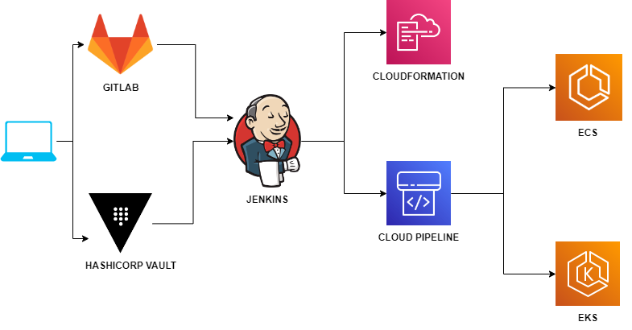

----
### Version control
- The DevOps toolchain starts with pushing code to a version control system.
- The most common version control systems include:


----
### GitFlow
Understanding GitFlow is important for security teams to:
- Contribute to development and operations workflows
- Prevent attackers from compromising the workflow


----
### Continuous Integration
Approving and completing a merge request creates a commit on the "main" branch and automatically triggers a pipeline:
- Ensure that changes integrate successfully with the rest of the codebase
- Executes automated unit tests and other automated checks
    - Red: no other check-ins are allowed until the build is fixed
    - Green: creates build artifacts for next steps in CD pipeline
- Fast feedback - build and test steps need to run in a few minutes to encourage iterative development (small, frequent changes)
----
<style scoped>
{
  font-size: 29px
}
</style>
### Continuous Delivery

Pipeline model and control framework extending Continuous
Integration:
- It uses the latest good build from CI, packages for deployment, and release.
- Changes are automatically pushed to test/staging environments to conduct more realistic/comprehensive tests.
- It can insert manual reviews/testing/approvals between pipeline stages.
- Log steps and results to provide audit trail from check-in to deploy.
- Any failures will "stop the line."
- No additional changes can be accepted until the failure is corrected.
- This ensures that code is always ready to be deployed.
- Changes may be batched up before production release.

----
<style scoped>
{
  font-size: 29px
}
</style>
### Continuous Delivery vs Continuous Deployement 


---
<style scoped>
{
  font-size: 29px
}
</style>
### Continuous Deployment

Continuous Deployment is how organizations like Netflix, Etsy, and Amazon push out changes n times per day/hour/minute:
- Changes are deployed directly and automatically to production using the CD pipeline once all tests/checks pass.
- Self-service - Changes are pushed to production by developers.
- Blue/Green Deployment - Deploy changes and switch between production environments using load balancing
- Canaries - Incremental deployment that stops and rolls back if errors occur
- A/B testing - Measuring the effect/acceptance of a change or new feature in production
- Dark Launching - Protect changes behind "feature switches"

---

# CI/CD Systems
Version control push events on the develop/main branches trigger workflow pipelines for building, testing, and deploying the changes.


---

### Jenkins pipeline as code declarative syntax
Jenkins pipeline building a docker image
```groovy
pipeline {
    agent { dockerfile true }
    stages {
        stage('Test') {
            steps {
                sh 'node --version'
                sh 'svn --version'
            }
        }
    }
}
```

---

### Jenkins credential manager

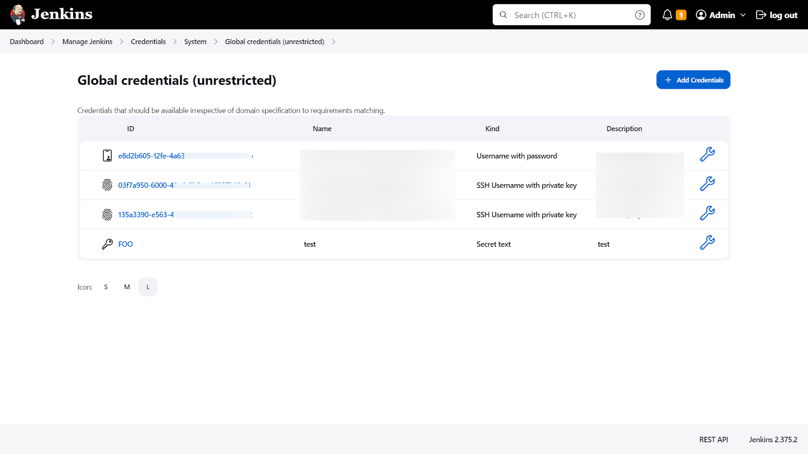

```groovy
AWS_ACCESS_ID = ${env.AWS_ACCESS_ID}
AWS_SECRET = ${env.AWS_SECRET}
```

---

## CI/CD Attacks
### SOLARWINDS

### CODECOV

---

## CI/CD Security Risks


---
<!-- _class: lead -->
## DevOps toolchain summary:
Security teams must understand how the CI/CD pipeline works, the tools involved, and how the teams use them before they start looking how and where to add security checks

---
<!-- _class: lead -->

#### Day 1 :Attacking and Hardening the DevOps Toolchain
## Securing DevOps toolchain

----
<style scoped>
{
  font-size: 29px
}
</style>
### DevOps / DevSecOps

Incremental, iterative development and rapid delivery in DevOps can significantly reduce this window of exposure:
* DevOps teams follow "just-in-time prioritization"
* Automated testing cheap and safe to push out changes quickly.
* DevOps teams follow Lean techniques.
* Automated security checks in the CI/CD pipeline will catch many vulnerabilities.
* Security fixes are "standard changes".
* DevOps encourages developers and ops and security specialists to work together.

---
<style scoped>
{
  font-size: 29px
}
</style>
### Security Champions: Breaking Down DevOps Silos
* Security experts embedded into the development organization
* Break down barriers between the central Security and DevOps teams
* Requires funding and support from upper management
* Provides several ancillary benefits:
    * The reputation of the company
    * Teaches valuable leadership skills 
    * Increased employee retention
----
<style scoped>
{
  font-size: 29px
}
</style>
### DevOps workflow
The DevOps workflow is based on five key phases:
 -Manual work done before merging code into a delivery branch
 -Automated Continuous Integration (CI) & Continuous Delivery (CD) process
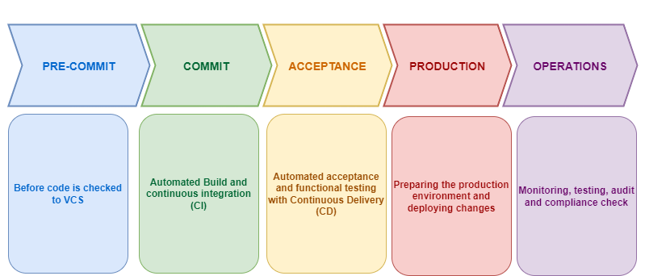

----
### DevOps workflow

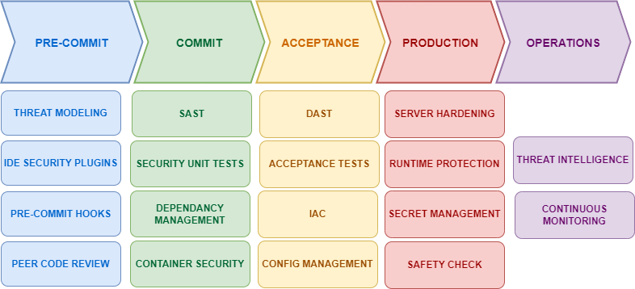

----
### DevOps workflow

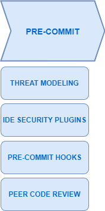

----
<style scoped>
{
  font-size: 29px
}
</style>
### RRA

- **Quick!** The RRA takes 30 to 60 minutes maximum.
- **Very high-level**. Details are for complete threat models. The RRA can become a complete threat model over time though!
- **Concise, readable**. Short and with clear risk levels.
- **Easy to update**. Can be run during any phase of the project development and continuously updated.
- **Informative**. Collects risk impact and a data dictionary. Also, collections information about how the service functions.
- **Let you know what to do**. The RRA includes the list of recommendations from the security team with a priority for each item.

----
<style scoped>
{
  font-size: 29px
}
</style>
## Threat Modeling

Ask a few basic questions:
1. Are you changing the attack surface of the system in a material way? Are you adding a new API or opening a new port, adding a new user type/role, adding or changing a data store/sink, calling out to a new service or system?
2. Are you changing the technology stack? Are you adding or significantly upgrading a framework or important library or language or runtime component?
3. Are you changing security controls: authentication or session management code, cryptologic, access control code or rules, auditing logic...?
4. Are you adding confidential/sensitive data or changing data classifications?
5. Are you modifying high-risk code?

---
<!-- _class: lead -->

# Store Markdown RRA and Threat Modeling in the repository /docs directory

----
## Code Inventory

```sh
$ scc path/to/your/code
───────────────────────────────────────────────────────────────────────────────
 Language            Files        Lines        Code     Comments       Blanks
───────────────────────────────────────────────────────────────────────────────
 Go                    112        50145       38876         5449         5838
 Markdown                8         2228        1710          163          355
 Shell                  11          799         598           97          104
 YAML                    6          515         408           10           97
───────────────────────────────────────────────────────────────────────────────
 Total                 137        53687       41670         5719         6394
───────────────────────────────────────────────────────────────────────────────


```
----
## Code Analysis: IDE Security Extensions

The VS Code Marketplace contains thousands of security-focused plugins:
- Semgrep
- Checkov/CFN Nag
- SonarLint/ ESLint
- Hadolint
- InSpec

----

## Version Control Security
Version control systems and git provide workflow capabilities for locking down the remainder of the pre-commit security controls:
- Git Hooks
- Mandatory peer reviews
- Mandatory security reviews
- High risk code approvals
----

## Git Commit Hooks

Run script automatically, checking for embedded secrets, code correctness at different point in the workflow :
- Local repository : pre-commit, commit, post-commit ...
- Remote repository: pre-receive, post-receive
- Implement team-wide workflow policies before CI

----

### Manual Code Reviews
Take advantage of code review workflows for security reviews
- Security team sets policies and train developers on how to de security code reviews. Create a checklist for them.
- Look for problems that static analysis tools don't find.
- Tag High-risk code

----

### Branch Protection 
All version control providers provides a branch protection capability:
- Require merge requests to commit to the branch
- It defines the role that can complete a merge request.
- It prevents users to directly push to the main branch
- it enables the CodeOwners approval workflow
----
### Code Owners

Inventory high risk code and identify groups and individuals responsible for approvals :
- Create CODEOWNERS file in the repository root directory
- Define directories or individual files in the CODEOWNERS file
- Require one or many approvers during the pull request to review changes
- The security team can participate in the GitFlow workflow
----
### Code Owners
```plaintext
# This is a comment.
# Each line is a file pattern followed by one or more owners.
# Specify the owners for the entire repository
*       @all-developers
# Specify the owners for security-related files
/security/ @security
# Specify the owners for user experience-related files
/frontend/ @user-experience
# Example for specific files
README.md @all-developers
# Example for a specific directory
docs/ @all-developers
# Example for specific file types
*.js @all-developers
CODEOWNERS @security @admin
```
----
<style scoped>
{
  font-size: 29px
}
</style>
### Detecting High Risk Code 
Using unit tests to check if a high-risk code file changed.
```node

describe('HighRiskCode Checksum Test', () => {
    const testCases = [
        { file: 'path/to/Jenkinsfile', checksum: '2bf33b66ddb07616f882ceed0718826af298a7' },
        { file: 'path/to/Dockerfile', checksum: 'fe83bf6f453698c5f78cabl67bca14c72daf32c0' },
    ];
    testCases.forEach(({ file, checksum }) => {
        it(`should verify the checksum of ${file}`, () => {
            const alertSpy = sinon.spy(requestCodeReview);
            const actualChecksum = getChecksum(file);
            const match = checksum === actualChecksum;
            if (!match) {
                requestCodeReview(file);
            }      
        });
    });
});
```
----
### Security Checklist: Pull Request Templates

Markdown based templates for starting a pull request can include checklists, including security tasks

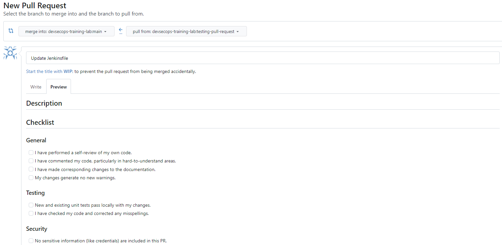

----
<!-- _class: lead -->

#### Summary
## Secure your Version Control System

----
### DevOps workflow - Security Controls

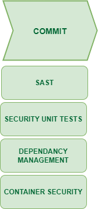

----
### Static Analysis : 
Provide fast and clear feedback on code commit:
* Run code scans in parallel with unit testing for speed.
* Run high-risk checks early in the pipeline to "fail fast."
* Do incremental scanning, if possible, as deep scanning takes too long for CI/CD, especially on large codebases,
* Set a max time limit with the dev team, alert them if the limit is breached and fix it.
* Return results directly to developers using their IDE or backlog list/tool.
* Run full/long-running scans out-of-band (nightly) or in the scanning factory.
----
<style scoped>
{
  font-size: 29px
}
</style>
#### Minimize False Positives
Developers will tune out results if you don't tune out false positives.
* Carefully review rules to identify which checkers provide high-confidence results.
* Fail the pipeline if these checks fail.
* Turn off noisy, low-confidence checks in the pipeline-run them separately and review/qualify them manually. Feed real positive findings back to the development team's backlog.
* Periodically review and re-tune rules and configurations.
Track and document tool configurations and decisions on which checkers or rules you disable (for compliance/governance).
---
### SAST : Configuration management

| IaC Technology  | Static Code Analysis Tools                                    |
|-----------------|---------------------------------------------------------------|
| Ansible         | KICS                                                          |
| CloudFormation  | cfn_nag, Cfripper, Checkov, KICS                              |
| Terraform       | Terrascan, Checkov, TFSec, KICS, ShiftLeft                    |

----
### SAST : Language Support
| Type              | Java                 | Node.js                   | Python           | PHP            |
|-------------------|----------------------|---------------------------|------------------|----------------|
| Code Quality      | SonarQube, PMD       | ESLint                    | Pylint, SonarQube| SonarQube, PHPStan, Psalm, Phan |
| Security Checker  | Fortify, Checkmarx,   | npm-audit, NSP            | Bandit           | RIPS           |
| Bug Corrector     | FindBugs             | Flow                         | Pyflakes         | Phan              |
 ---
## SAST : Semgrep
 Semgrep provides a lightweight, multi-language, extensible static analysis solution.
 - Open-source
 - Community driven rules
 - Language support : Go, Java, JavaScript, Python ...
 - Support automation !!!!!!!
 ---
 
 ## SAST : Semgrep
```plaintext
semgrep --config "p/expressjs" --config custom_rules.yml /path/to/your/express/app

/path/to/your/express/app/index.js
  5:14  error  jwt-hardcoded-secret  Avoid hardcoding JWT secrets
  10:5  error  security-audit-rule   Some other security issue

2 issues
```
----
 ## Semgrep : Custom rules
 Custom rules can be added using the Semgrep playground to test the rule syntax : 
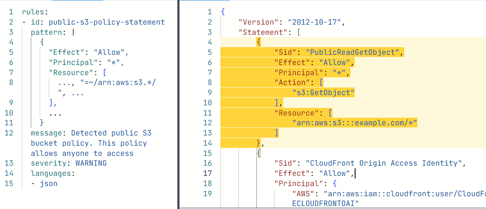

----

### Dependencies : Component Analysis

| Dependency Checker       | Supported Languages                            |
|--------------------------|------------------------------------------------|
| OWASP Dependency-Check   | Java, JavaScript, .NET, Python, Ruby, PHP, Node.js |
| retire.js                | JavaScript, Node.js                            |
| safety                   | Python                                         |
| PHP Dependency Checker | PHP                                           |

----
<style scoped>
{
  font-size: 29px
}
</style>
### Machine Readable report
Running security tools in CI/CD requires a supported machine-readable output format.
* xUnit/JUnit
  * Standard XML schema for reporting pass/fail unit test results
* Checkstyle
  * Standard XML schema for reporting static analysis results
* SARIF (Static Analysis Results Interchange Format)
  * JSON based schema primarily used for displaying results in GitHub
* JSON
  * Custom schemas are machine-readable, but you have work to do!
----
<!-- _class: lead -->

# Containers Security

----
<style scoped>
{
  font-size: 29px
}
</style>
# NIST SP 800-190 
Containers will force you to use different security tools and practices:
* Adopt new technologies for writing secure Dockerfiles and scanning images.
* Understand how to sign and store images securely in a registry.
* Leverage container-optimized host operating systems (e.g., Google
COS) to reduce attack surface.
* Obtain container-specific runtime security appliances that manage dynamic and ephemeral containerized environments. Perimeter-based runtime defenses like IDS/IPS/WAF do not have visibility inside container networks.
----
### Container Security life cycle
Security must shift left and consistent policies are implemented along each step of the container life cycle:

1- Pre-commit
2- Version Control
3- CI/CD
4- Container Registry
5- Container Orchestrator

----
<style scoped>
{
  font-size: 18px
}
</style>
## Dockerfile Commands
| Command      | Description                                                                                                                                     
|--------------|--------------------------------------------------------------------------------------------------------------------------------------------------
| `FROM`       | Specifies the base image to use for the Docker image.                                                                                            
| `LABEL`      | Adds metadata to the image, such as a maintainer or version.                                                                                     
| `RUN`        | Executes a command in a new layer on top of the current image and commits the results.                                                          
| `CMD`        | Provides the default command to run when the container starts. Can be overridden with `docker run`.                                             
| `ENTRYPOINT` | Configures a container to run as an executable. Unlike `CMD`, it is not overridden by the `docker run` command.                                  
| `WORKDIR`    | Sets the working directory for any `RUN`, `CMD`, `ENTRYPOINT`, `COPY`, and `ADD` instructions that follow it.                                   
| `COPY`       | Copies new files or directories from `<src>` and adds them to the file system of the container at the path `<dest>`.                            
| `ADD`        | Similar to `COPY` but can also extract local tar archives and download remote files.                                                            
| `ENV`        | Sets an environment variable.                                                                                                                 
| `EXPOSE`     | Informs Docker that the container listens on the specified network ports at runtime.                                                            
| `USER`       | Sets the username or UID to use when running the image and for any `RUN`, `CMD`, and `ENTRYPOINT` instructions that follow it.                 
| `VOLUME`     | Creates a mount point with the specified path and marks it as holding externally mounted volumes from native host or other containers.          
| `ARG`        | Defines a variable that users can pass at build-time to the builder with the `docker build` command.                                             

----
<style scoped>
{
  font-size: 29px
}
</style>
## Hunt The Bug
```dockerfile
FROM mcr.rnicrosoft.com/dotnet/core/sdk:2.2
ARG ENVIRONMENT=prod
ENV ASPNETCORE ENVIRONMENT=$(ENVIRONMENT} 
ENV CERTIFICATE_PASSPHRASE-mycertpassphrase
RUN apt-get update && apt-get install -y libss1-dev=1.1*
COPL cert.conf -/cert.conf
RUN openssl reg -x509 -nodes -days 3650 -newkey rsa:4096 -keyout app.key
-out app.ert -config cert.cont -passin pass:$(CERTIFICATE_PASSPHRASE)
RUN openssl pkcsl2 -export -out app.pfx -inkey app.key -in app.crt
-passout pass: $(CERTIFICATE_PASSPHRASE]
USER root
WORKDIR /WWW
ENTRYPOINT ["dotnet", "Sans. CreditUnion API.dil"1]
```
----
## Container Security : Pre-commit

Container security starts upfront the pre-commit phase with policies:
- SAST for Dockerfile misconfiguration
- Locking down the base image supply chain
- Installing approved binaries inside a base image
- Using multi-stage builds to create minimalistic images
- Passing build time secrets to image build commands

----
<style scoped>
{
  font-size: 29px
}
</style>
### SAST for Dockerfiles

| Tool            | Description                                                                                       
|-----------------|---------------------------------------------------------------------------------------------------
| Hadolint        | A linter for Dockerfiles that helps you build best practice Docker images by providing tips.     
| KICS            | An open-source tool that finds security vulnerabilities, compliance issues, and misconfigurations in IaC.                                               |
| Dockerfilelint  | A linter for Dockerfiles to ensure adherence to best practices.                                                                                  |
| dockerfile-lint | Another linter for Dockerfiles focusing on best practices and potential issues.                                                                      |
----

# Hadolint
Hadolint parses Dockerfiles into Abstract Syntax Trees (AST) and runs rules:
* Supports an approved list of trusted registries
* Suppress false positives via inline comments or a configuration file
* Export formats include checkstyle, sarif, and json
```plaintext
$ hadolint --trusted-regestry gcr.io ./Dockerfile
Dockerfile:4 DL3008 warning: Pin versions in apt-get install. Instead of `apt-get install -y python3` use `apt-get install -y python3=<version>`
Dockerfile:7 DL3018 info: Pin versions in pip. Instead of `pip install -r requirements.txt` use `pip install -r requirements.txt && pip freeze > requirements.txt`
Dockerfile:9 DL4000 warning: MAINTAINER is deprecated
Dockerfile:10 DL3020 error: Use COPY instead of ADD for files and folders
Dockerfile:14 DL3025 info: Use arguments JSON notation for CMD and ENTRYPOINT commands
```
----
### Supply chain hardening
MITRE ATT&CK Containers T1525: Implant Internal Image
* Images from public registries may contain vulnerabilities or malware, easy and common attack vector
* Mitigations:
  * Building inventory of approved base images
  * Downloading base images from trusted suppliers
  * Scanning base images for vulnerabilities
  * Creating a private container registry
  * Signing custom images and storing in a private registry

----
# Container image trusted suppliers
- Docker hub (Verified Publisher)
- Platform One Iron Bank
- MCR
- ECR Gallery 
----
<style scoped>
{
  font-size: 29px
}
</style>
# Conftest - Trusted supplier policy
The big difference between Contest and a static analysis engine like hadolunt is the ability to wnte custom tests using the Open Policy Agent (OPA - pronounced oh-pa) Rego query language. The example above shows how to create a trusted images Rego policy.
```
package main
trusted_suppliers = ["ubuntu:20.04", "alpine:3.13", "node:14-alpine"]
deny[msg] {
    input[i].Cmd == "from"
    image := input[i].Value
    not image in trusted_suppliers
    msg = sprintf("The image '%s' is not from a trusted supplier.", [image])
}
```
----
## Conftest - Trusted supplier policy
Pre-commit hooks can validate conftest policies for trusted base images and package install commands:
```plaintext
$ conftest test --namespace image, install Dockerfile
```
* Failing policies are shown in the console output
* Optional output formats for table, junit and json
```plaintext
FAIL - Dockerfile - image - [untrusted_supplier] Untrusted supplier identified: mer.rnicrosoft.com/dotnet/core/sdk:2.2
FAIL - Dockerfile - install - [install_command] Disallowed command found: ["apt-get update &s apt-get install -y libss1-dev=1.1**]
2 tests, O passed, O warnings, 2 failures, O exceptions
```
----
<style scoped>
{
  font-size: 29px
}
</style>
### Minimal image with multi-stage Builds
Multi-stage builds use multiple FROM statements to differentiate
"development" from "runtime" base images.
* Stage 1 uses a base image with an SDK to build the application
(1.5GB)
* Stage 2 copies the binaries into an Alpine runtime image (120MB)
```Docker
FROM mcr.microsoft.com/dotnet/nightly/sdk:6.0 AS build
COPY ./Web/  ./Web/
RUN dotnet publish "./Web/Website.csproj" -c Release -o /app/bin
FROM mcr.microsoft.com/dotnet/nightly/runtine:6.0.2-alpine3.15
WORKDIR /www
COPY --fron-build /app/bin ./ ENTRYPOINI ["dotnet", "Website.dll"]
```
----
## Configure Build Time Secrets

Docker BuildKit supports build secrets (--secrets) to help developers avoid hard-coding secrets in Dockerfiles and environment variables:

```docker
COPY cert.conf /cert.conf
RUN --mount-type-secret, id-passphrase openssl req -x509 -nodes -days 3650 - newkey rsa: 4096 -keyout app.key -out app.ert -config cert.conf
-passin file: ///run/secrets/passphrase
RUN --mount-type-secret, id-passphrase openssl pkes12 -export -out app.pfx - inkey app.key -in app.ert -passout file: ///run/secrets/passphrase
```
Running the docker build command, setting the tag, and configuring a build time secret:
```sh
echo $ (CERTIFICATE_PASSPHRASE) > passphrase
docker build --tag dntools/base: insecure --secret id-passphrase, sro-passphrase --file Dockertile
```
----
## Docker scan
- Scan images and Dockerfiles with docker scan CLI (Snyk) before committing Dockerfile
- Requires Docker Hub account to run scan locally 
```sh
$ docker scan --file./Dockerfile
X Critical severity vuinerability found in Curl/1ibcur13
Description: Double Free
Into: https: //snyk.10/vuln/SNYK-DEBIAN9-CURI-466508
```
----
## Container Security - CI/CD
Merge requests triggering CI/CD workflows responsible for building and releasing container images must certify the image:
* Enforce pre-commit controls and validate results.
* Build a release candidate image and perform in-depth scanning for vulnerabilities.
* Sign the release candidate image, tagging for production, and pushing to the container registry.
----
# Open Source Container Scanning Tools
- Anchore
- Docker Bench
- OpenSCAP plugin
- Trivy
 ----
 # Trivy Image Scanning
  - Scannning the container image in CI/CD
  - Output format : table, json, sarif ...
  ----
  # Cosign Container Image Scanning 
  - Cosign support artifact signings
  - Signing key storage in AWS, Azure, GCP, VAULT, and on premise

  ```bash
$ docker push 123456789012.dkr.ecr.us-west-2.amazonaws.com/api-image:1.4
$ cosign sign --key awskms:///alias/dm/cosign 123456789012.dr.ecr.us-west-2.amazonaws.com/api-image:1.4

1.4: digest: sha256:b30e9b9aße0e29d1852c07825dcca52d51ad58920849851747c64a5379bb1a95 size: 1793
Pushing signature to: 123456789012.dkr.ecr.us-west-2.amazonaws.com/api-image
  ```
  ----
### Container Security -  Registryg
Private container registries storing production images are the bridge between development and operations:
* They store image signature metadata for validation.
* They enforce strict access control on registry read and write operations.
* They are continuously scanning registries for new vulnerabilities and sending notifications.

--- 
# AWS ECR - Best practices
AWS Elastic Container Registry (ECR) security best practices:
* Isolate container registries in a dedicated DevOps account
* Restrict access using resource-based and identity-based IAM policies for cross-account access
* Protect production images from corruption or deletion with immutable tagging
* Enable basic container image scanning
----
## Container Security - Runtime

Container runtimes and orchestrators are responsible for pulling registry images and managing the workloads:
* Review security hardening guides for the selected runtime
* Admission controllers validate image signatures and security
- requirements
* Runtime security appliances inspect network traffic, monitor lateral communications, quarantine containers, and run vulnerability scans

---

# kubernetes Security/Insecurity
 Insecure Workload Configurations
 Supply Chain Vulnerabilities
 Overly Permissive RBAC
 Policy Enforcement
 Inadequate Logging
 Broken Authentication
 Network Segmentation
Vulnerable Components

----
# Istio
Istio is an open source service mesh that layers transparently onto existing distributed applications. Istio’s powerful features provide a uniform and more efficient way to secure, connect, and monitor services. Istio is the path to load balancing, service-to-service authentication, and monitoring – with few or no service code changes

----
 # Istio gives you
Secure service-to-service communication in a cluster with mutual TLS encryption, strong identity-based authentication and authorization
Automatic load balancing for HTTP, gRPC, WebSocket, and TCP traffic
Fine-grained control of traffic behavior with rich routing rules, retries, failovers, and fault injection
A pluggable policy layer and configuration API supporting access controls, rate limits and quotas
Automatic metrics, logs, and traces for all traffic within a cluster, including cluster ingress and egress

----
## Effects of crime
1- Workload disruptions
2- Resource Consumption issues
3- Traffic issues : latency
4- Security issues

----

# Ambiant Mesh : 2022

level 4 communication : TCP routing
Security : mTLS tunneling, ZTunnel 
Observability : TCP metrics and logging

Resource efficiency
Optimal scaling of L7 proxies
Improved performance
Increased Security 

----
<!-- _class: lead -->

#### eBPF
## Cilium eBPF based service Mesh

----
 ## Cilium Service Mesh

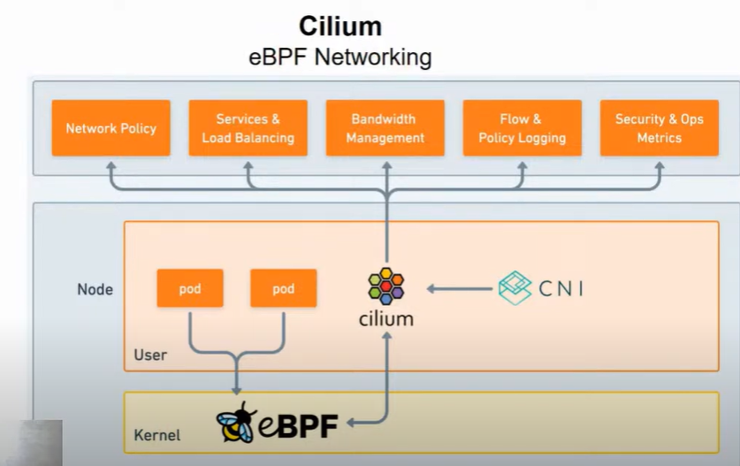

----
 ## Cilium Service Mesh

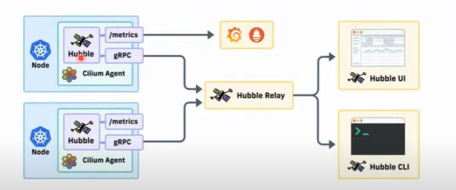

----
 ## Cilium Service Mesh

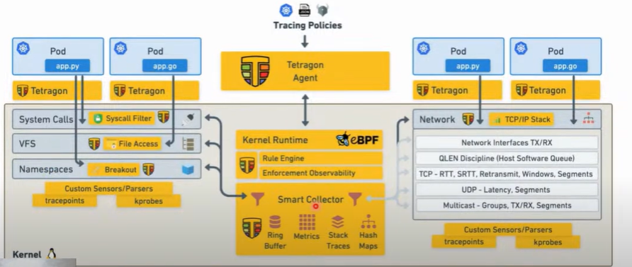

----
<!-- _class: lead -->

#### Infra Structure As Code (IaC)
## Security and best practices

----
# IaC Pipeline
With the Infrastructure as Code (IaC) templates written, all configuration changes should go through the IaC CI/CD pipeline. This requires the engineer to check code into version control using a feature branch to create a pull request that will then be merged back into the main branch. Once this occurs your Infrastructure as Code pipeline is kicked off.
- Develop Environment 
- Stage Environment
- Production Environment 
----
<style scoped>
{
  font-size: 29px
}
</style>
# IaC Security 
Infrastructure as Code (IaC) deployments introduce new security concerns:
* Templates provide a blueprint of the entire cloud environment.
* Secrets are everywhere.
  * Service account keys, SSH keys, API keys, Terraform state file
* The Least privilege is hard.
  * Service accounts deploying templates require elevated permissions
* There are more supply chain attacks.
  * Terraform modules and nested CloudFormation templates
* Code analysis (SAST) requires a different toolchain.
----
# IaC Security 
- Understand The Configuration (RRA)
- Participate in peer reviews
- Integrate code analysis tools
- Set up security rules
---
# AWS EC2
```cloudformation
Resources:
  MyEC2Instance:
    Type: 'AWS::EC2::Instance'
    Properties:
      InstanceType: t2.micro
      SecurityGroups:
        - !Ref MySecurityGroup
      ImageId: ami-0c55b159cbfafe1f0 
```
---
# AWS EC2
```cloudformation
  MySecurityGroup:
    Type: 'AWS::EC2::SecurityGroup'
    Properties:
      GroupDescription: 'Allow HTTP and HTTPS traffic'
      SecurityGroupIngress:
        - IpProtocol: tcp
          FromPort: 80
          ToPort: 80
          CidrIp: 0.0.0.0/0
        - IpProtocol: tcp
          FromPort: 443
          ToPort: 443
          CidrIp: 0.0.0.0/0
```
---
IaC Security Scanning Tools
- Terrascan
- Semgrep
- Kicks
- Easy_infra
- checkov
- cfn_nag

---
<style scoped>
{
  font-size: 22px
}
</style>
# checkov
Checkov is a Python command-line package: 
- Support Terraform, CloudFormation,K8s, Dockerfile.
- Thousands of security policies across AWS, Azure and GCP.

| Option     | Description                                           | Usage Example                                        |
|------------|-------------------------------------------------------|------------------------------------------------------|
| `-d`       | Directory to scan for infrastructure as code files    | `checkov -d /path/to/iac`                            |
| `-f`       | Specific file to scan                                 | `checkov -f /path/to/iac/file.yaml`                  |
| `-o`       | Output format (can be `cli`, `json`, `junitxml`, etc.)| `checkov -o json -d /path/to/iac`                    |
| `-c`       | Path to Checkov configuration file                    | `checkov -c /path/to/checkov/config.yaml`            |
| `--framework` | Specify the framework to scan (e.g., `terraform`, `cloudformation`, `kubernetes`, etc.) | `checkov --framework terraform -d /path/to/iac`     |
---
## Checkov running the scan 
Running Checkov on the templates' directory
```sh
checkov -directory ./templates --framewok terraform --output json > checkov.json
```
```json
{
  "summary": {
    "passed": 2,
    "failed": 2,
  },
  "results": [
    {
      "check_id": "BC_AZR_NETWORKING_3",
      "check_name": "Ensure that Network Security Group inbound rule does not allow ALL ports from ALL traffic",
      "check_result": {
        "result": "FAILED"
      },
      "resource": "azurerm_network_security_rule.example"

```
---
# checkov False positives

Suppressing the CKV2-AZURE-10 false positive using the checkov:skip comment:
```terraform
ressource "azureem_virtual_machine" "bastion_vm"{
  #checkov:skip=CKV2_AZURE_10: Antivirus and patching is used with an EDR
}
```
---
# CloudFormation Nag
cfn_nag is a CloudFormation template checker:
- Rule support includes IAM, security groups, logging, encryption ...
- Accept -i for the input 
- Accept -o for the output that could be text or json
---
## cfn_nag , False Positives
Suppressing the W2 and W9 cfn_nag false positives using the metadata attribute:
```
SecurityGroupPublic:
  Type: AWS::EC2:: SecurityGroup
  Metadata:
    cfn_nag:
      rules_to_suppress:
        - id: W9 reason: "This policy has been approved by security. (REF - 06152018]
        - id: W2 reason: "This policy has been  approved by security. (REF - 06152018]'
Properties:
```
---
<style scoped>
{
  font-size: 25px
}
</style>
## Configuration Management as Code
 Infrastructure as Code is a new way of working for many System administrators. It is less about system administration and more about software engineering:
* Establishing and following coding standards and patterns and defining and enforcing security and compliance policies in code.
* Organizing code into modules and creating reusable functions and templates.
* Implementing static analysis/linting tools to catch common mistakes and enforce good coding practices/style.
* Checking all code/configuration into version control.
* Establishing team disciplines of code reviews and refactoring.
* Writing automated tests to prove that the changes are implemented correctly-including Test-Driven
Development (TDD) where tests are written before the code is changed (red/green).
---
# Configuration Management Tooling

 ## Declarative 
" What ?", Desired State, easy verification, Puppet, CFEngine
## Procedural
"How ?", Detailed steps, Easy to use and understand, End state not captured, Ansible, Chef

----
<style scoped>
{
  font-size: 29px
}
</style>
# Configuration Management as Code Hardening
Follow basic good practices in setting up configurations and take advantage of hardening templates/recipes and examples.
* dev-sec.io open-source hardening framework
* CIS benchmarks
* DoD STIG templates
* SIMP Project from NSA (https://www.simp-project.com/)

Always carefully review open-source templates/modules before use.

----

## Configuration Management - Test System 

- Phoenix test Servers
- Vagrant can be a rapid and simple tool to spin temporary disposable VM sandbox for testing config changes
- After testing, tear down and clean up the test runtime.
- Reduce the ATTACK surface

----
## Building Gold Images with Packer
Packer is an open-source tool for creating machine images on different platforms with a common configuration:
* Source images from Amazon EC2, Azure Virtual Machines, Google Compute Engine, Docker, VMWare, Virtual Box
* Apply Ansible, Puppet, or Chef configurations
* Publish a custom virtual machine image to the target platform
* Command-line driven and built for CI/CD

----
### Ansible security

Automated testing tools for Ansible:
1. Run ansible-lint before committing code to source repository.
2. Run ansible-test for unit and integration tests suites.
3. Run Checkmarx's KICS scanner to check for dangerous
Ansible code.
4. Run InSpec stories against test VM to validate final configuration

----
### InSpec : Automationg Compliance Checking
Open-source language to write compliance checks that auditors can understand.
* Works like Serverspec: test the actual configuration against expected results + report deviations
* Tests include severity/risk level and description metadata to match against compliance checklist items or regulatory policies
* Check resources on Linux, Unix,Windows, AWS, Azure, GCP, VMware InSpec tests become your compliance requirements.
----
<!-- _class: lead -->

#### Make your own harden images
## Jenkins + Packer + Ansible + Inspec

----